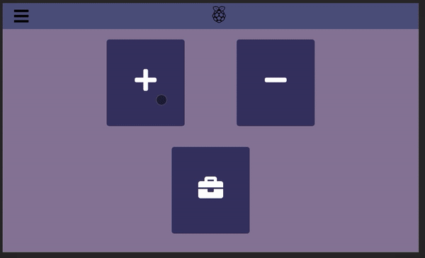
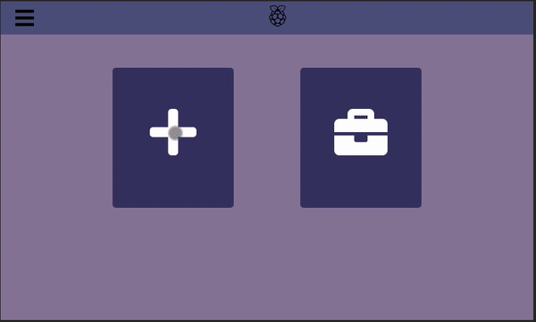
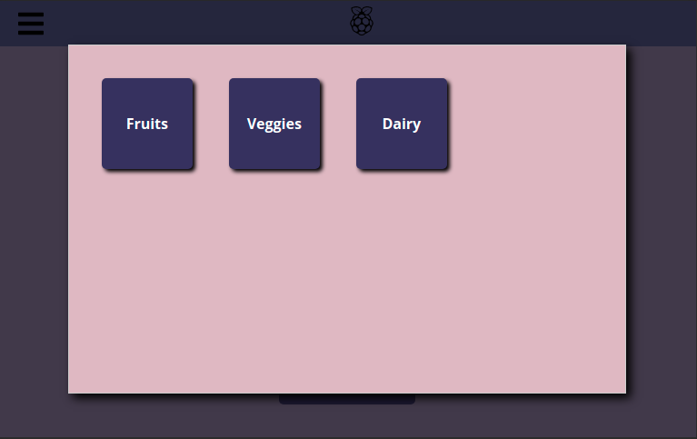
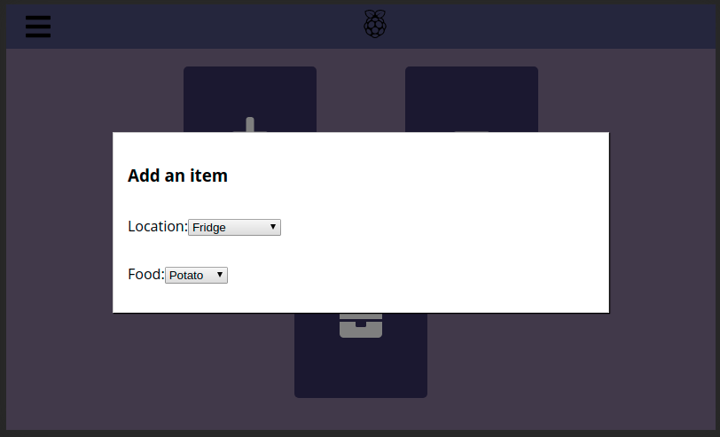
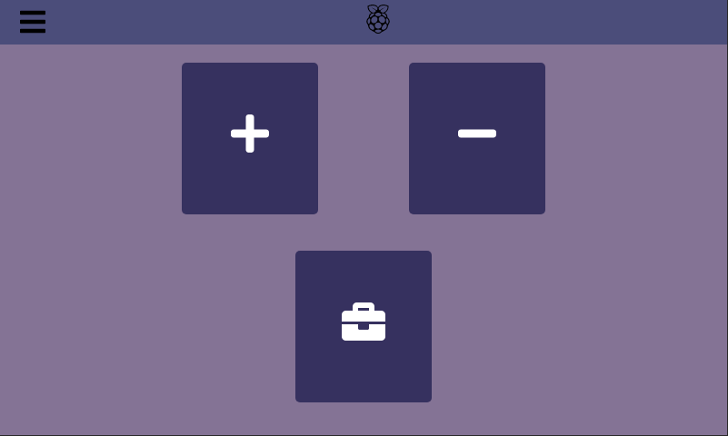

# React Fridge Project

This project will be a little app I use to track various fridge and kitchen related activities in my own kitchen. This is the first larger scale project that I am attempting with my Raspberry Pi. It's core functionality will be to track food that we currently have inside the fridge. We will hopefully, either directly, or through an app, be able to enter things into the fridge, and take them out. There are several side functionalities I would like to include as well:
+ Keep track of common foods and their common expiration times
+ Use above info to notify user on foods that are going to go bad soon, etc
+ There are more that I can't think of right now

Color Pallette (will move into file later) 
363062
4d4c7d
827397
d8b9c3

## Log

### 4/25/20
+ Set up redux to track state through the menus
+ Nothing else really to show but I did a good amount of work today actually!

### 4/24/20
+ Created new MenuContent and RenderList components, now must hook up project to database
+ RenderList works recursively and so can go through an object of any length 
+ App currently simply displays choice as a h1 after it has been chosen, needs to also be reset
+ Wondering if Redux should take care of "setting" the chosen items into the main state, rather than trying to pass yet another function to each RenderList
+ Removed "-" button, all remove item functionality can just be done through the inventory
+ Linked to firebase, app now gets "options" object from firebase rather than a local file
+ Added css spinner, will show when "options" has not been loaded yet, and will probably come in handy later too

#### Current MenuContent implementation

#### Current Spinner Look

### 4/21/20
+ Separated Button component with new Tile Component. Button is for the buttons on main page, while Tile is for the buttons within the modal menus
+ Started on conversion of MenuContent into a recursive component

#### Current Layout for Modal Menu as of 4/21

### 4/15/20
+ Changed ModalMenu component to Modal after realizing I need a generic modal, not one just for the menus
+ Changed ButtonTile component to Button for nearly the same reason
+ Created MenuContent, which will choose and render which menu should be shown, is wrapped with Modal
+ Realized I will need to make a new screen, for choosing ingredients. Probably a scrollable page of ingredient tiles
+ Thus, ingredients database must be precreated, will probably not be able to create new ingredients through the Pi app

#### Current Layout for Main Menu as of 4/16

### 4/12/20
+ Improved layout
+ Changed buttons to all font awesome icons
+ Added hamburger drawer toggle button, no functionality yet
+ Created logo component

### Current App Layout

### 4/11/20
+ Set up project
+ Created project skeleton and basic component tree
+ Created custom button component 
+ Placed custom buttons in tentative layout